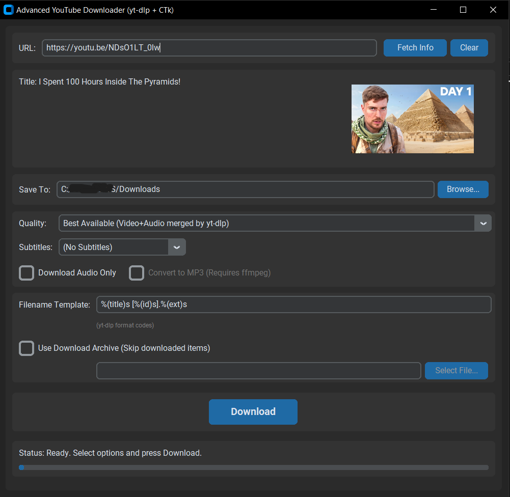

# Modern YouTube Downloader



A sleek Python GUI application for downloading YouTube videos and playlists using yt-dlp with a modern CustomTkinter interface.

## Features

- 🎯 Modern, user-friendly GUI built with CustomTkinter
- 🎥 Support for both single videos and playlists
- 📋 Multiple quality options with detailed format information
- 🎬 Video thumbnail preview
- 📝 Subtitle/Caption download support
- 🎵 Audio extraction with MP3 conversion option
- 📊 Download progress tracking
- 📁 Flexible download directory selection
- 📝 Customizable filename templates
- 🔄 Download archive support to skip previously downloaded items

## Requirements

- Python 3.x
- Required packages:
  - yt-dlp
  - customtkinter
  - Pillow
  - requests
  - tkinter (usually comes with Python)
- ffmpeg (optional, required for MP3 conversion)

## Installation

1. Ensure Python 3.x is installed on your system
2. Install the required packages:
   ```bash
   pip install yt-dlp customtkinter Pillow requests
   ```
3. (Optional) Install ffmpeg for MP3 conversion:
   - Windows: Download from [ffmpeg.org](https://ffmpeg.org/) and add to PATH
   - Linux: `sudo apt install ffmpeg`
   - macOS: `brew install ffmpeg`

## Usage

1. Run the application:
   ```bash
   python youtube_downloader_gui.py
   ```

2. Enter a YouTube URL (video or playlist)
3. Click "Fetch Info" to load video details
4. Configure your download:
   - Select video quality/format
   - Choose subtitle language (if available)
   - Enable audio-only mode if desired
   - Set MP3 conversion (requires ffmpeg)
   - Configure output filename template
   - Enable download archive if needed
5. Choose download location
6. Click "Download" to start

## Advanced Features

### Quality Selection
- Automatically sorts and displays available formats
- Shows resolution, format, and file size
- Indicates combined (video+audio) vs. separate streams
- Special handling for high-quality formats (4K, 60fps)

### Audio Options
- Extract audio only
- Convert to MP3 format (requires ffmpeg)
- Best quality audio extraction

### Subtitle Support
- Download subtitles in various languages
- Support for both manual and auto-generated captions
- Clear indication of subtitle source

### Playlist Support
- Download entire playlists
- Skip already downloaded items using archive
- Consistent quality selection across playlist

### File Management
- Custom filename templates using yt-dlp format codes
- Download archive to track completed downloads
- Flexible output directory selection

## Troubleshooting

If you encounter issues:

1. Update yt-dlp:
   ```bash
   pip install --upgrade yt-dlp
   ```

2. Common solutions:
   - Verify the YouTube URL is accessible
   - Check internet connection
   - Ensure write permissions in download directory
   - For MP3 conversion, verify ffmpeg is installed
   - For age-restricted videos, you may need to provide cookies

## License

This project is open source and available for personal use.

## Credits

- Built with [CustomTkinter](https://github.com/TomSchimansky/CustomTkinter)
- Powered by [yt-dlp](https://github.com/yt-dlp/yt-dlp)
